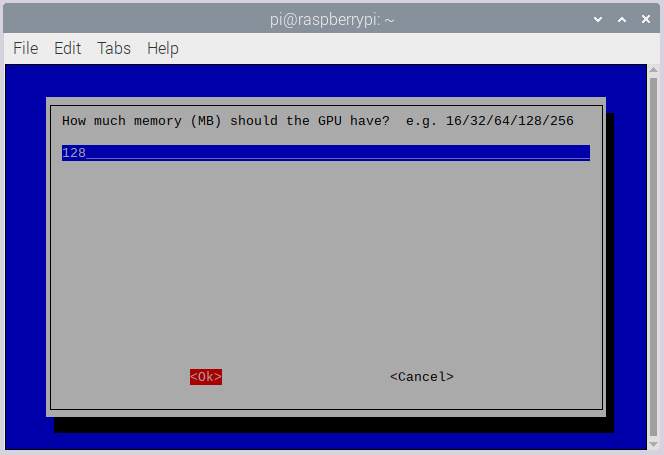

# Driving Alarm project

Written on October 5, 2022

Latest edited on October 7, 2022

Hardware dependencies of this project: Raspberry Pi 3 Model B+, MPU6050, Google Pixel 3.

For Raspbian script source codes, see [raspbian directory](https://github.com/LeslieLiuZJNU/project-driving-alarm/tree/main/DrivingAlarmForRPi).

For Android application source codes, see [android directory](https://github.com/LeslieLiuZJNU/project-driving-alarm/tree/main/DrivingAlarmForAndroid).

## Preparation on Raspberry Pi

### Hardware preparation

Components: Raspberry Pi 3 Model B+, Raspberry Pi Camera Module, MPU6050.

Connect them as the following schematics show.


### Software preparation

(To simplify the construction processes for software environment, just download the system image from [release](https://github.com/LeslieLiuZJNU/project-driving-alarm/releases) and write it into the TF card.)

#### Install the Raspbian system

Download the legacy raspbian that is based on buster 10. This version allows opencv and mediapipe to run correctly on RPi. After downloading, unzip it and get the system img file.

[2020-02-13-raspbian-buster](https://downloads.raspberrypi.org/raspbian/images/raspbian-2020-02-14/2020-02-13-raspbian-buster.zip)


Download the Win32 Disk Imager that is used for writing the system into the TF card.

[Win32 Disk Imager](https://win32diskimager.org/)


After writing, open the boot partition, create a configuration file "wpa_supplicant.conf", edit this file and write the following with available Wi-Fi access:
```
country=US # The local country code
ctrl_interface=DIR=/var/run/wpa_supplicant GROUP=netdev
update_config=1
network={
ssid="the_wifi_ssid"
psk="the_wifi_password"
}
```

Create a empty file "ssh" to make sure the raspbian starts up with ssh open.


Find the IP address of the RPi, and get connection to it through ssh with username "pi" and password "raspberry".

Open VNC in Interfacing Options in Raspberry Pi Software Configuration Tool.
```
sudo raspi-config
```


Then reboot the RPi and connect to it through VNC Viewer with username "pi" and password "raspberry".
```
sudo reboot
```
[VNC Viewer](https://www.realvnc.com/en/connect/download/viewer/)

#### Set up the environment for MPU6050
RPi communicates with MPU6050 by I2C protocol. Open Raspberry Pi Software Configuration Tool. Turn I2C on in "Interfacing Options".
```
sudo raspi-config
```


Install the smbus package for Python.
```
sudo apt-get install python3-smbus
```

#### Set up the environment for Bluetooth serial connection

(Reference from [Raspberry Pi to Android SPP Bluetooth communication](https://www.youtube.com/watch?v=sY06F_sPef4))

Open Raspberry Pi Software Configuration Tool. Turn Serial on in "Interfacing Options".
```
sudo raspi-config
```


Install the serial module for Python.
```
sudo pip3 install pyserial
```

Open the bluetooth service file, add Serial Port Profile into the initial procedure.
```
sudo nano /etc/systemd/system/dbus-org.bluez.service
```


Reboot the RPi.

Create a systemd service, to let RPi keep waiting for serial connection on Bluetooth device hci0 when it starts up.
```
sudo nano /etc/systemd/system/rfcomm.service
```
```
[Unit]
Description=RFCOMM service
After=bluetooth.service
Requires=bluetooth.service

[Service]
ExecStart=/usr/bin/rfcomm watch hci0

[Install]
WantedBy=multi-user.target
```

Enable and start the rfcomm service.
```
sudo systemctl enable rfcomm.service
sudo systemctl start rfcomm.service
```

Get Bluetooth paired with the Android phone.
```
sudo bluetoothctl
```
```
power on
agent on
scan on
pair THE_MAC_ADDRESS_OF_THE_PHONE
trust THE_MAC_ADDRESS_OF_THE_PHONE
exit
```

#### Tune up the RPi for vision based projects

(Reference from [[Tutorial] Tune up your Raspberry Pi for Vision Based Projects](https://www.youtube.com/watch?v=00c2GTpRaU))

Edit the configuration file for swap memory, and change the value CONF_SWAPSIZE to 2048.
```
sudo nano /etc/dphys-swapfile
```


Open Raspberry Pi Software Configuration Tool. Change the GPU memory to 128MB in "Advanced Options" -> "Memory Split".
```
sudo raspi-config
```



#### Install OpenCV and MediaPipe

For developers in China, repository can be changed to the USTC.
```
sudo sed -i 's|raspbian.raspberrypi.org|mirrors.ustc.edu.cn/raspbian|g' /etc/apt/sources.list
sudo sed -i 's|archive.raspberrypi.org|mirrors.ustc.edu.cn/archive.raspberrypi.org|g' /etc/apt/sources.list.d/raspi.list
sudo apt-get update
```

```
sudo pip3 config set global.index-url https://pypi.mirrors.ustc.edu.cn/simple
```

Install the dependencies for OpenCV.
```
sudo apt-get install -y libopencv-dev python3-opencv libatlas-base-dev libjasper-dev libqtgui4 python3-pyqt5 libqt4-test
```

Downgrade the numpy to proper version. If RPi cannot find this package, get it manually from [piwheels](https://www.piwheels.org/simple/numpy/numpy-1.21.5-cp37-cp37m-linux_armv7l.whl).
```
sudo pip3 install https://www.piwheels.org/simple/numpy/numpy-1.21.5-cp37-cp37m-linux_armv7l.whl --upgrade --ignore-installed
```

Install OpenCV for Python.
```
sudo pip3 install opencv-python
```

Install the dependencies for MediaPipe.
```
sudo apt install ffmpeg python3-opencv libxcb-shm0 libcdio-paranoia-dev libsdl2-2.0-0 libxv1 libtheora0 libva-drm2 libva-x11-2 libvdpau1 libharfbuzz0b libbluray2 libatlas-base-dev libhdf5-103 libgtk-3-0 libdc1394-22 libopenexr23
```

Install MediaPipe for Python.
```
sudo pip3 install mediapipe-rpi3
```

(Optional)Clean the local cache.
```
sudo apt-get autoclean
```

#### Deploy the application on RPi

Create a Python script and write the following:

```
mkdir /home/pi/DrivingAlarmForRPi
nano /home/pi/DrivingAlarmForRPi/DrivingAlarmForRPi.py
```
```python
import cv2
import mediapipe as mp
import numpy as np
import serial
import smbus
import math
import time

MPU6050_ADDR=0x68
MPU6050_SMPLRT_DIV=0x19
MPU6050_CONFIG=0x1a
MPU6050_GYRO_CONFIG=0x1b
MPU6050_ACCEL_CONFIG=0x1c
MPU6050_PWR_MGMT_1=0x6b
MPU6050_ACCX_DATA=0x3b
MPU6050_ACCY_DATA=0x3d
MPU6050_ACCZ_DATA=0x3f
MPU6050_GYROX_DATA=0x43
MPU6050_GYROY_DATA=0x45
MPU6050_GYROZ_DATA=0x47

class MPU6050(object):
    def __init__(self, address = MPU6050_ADDR, bus = 1,scal_acc=4,scal_gyro=1000):
        self.bus = smbus.SMBus(bus)
        self.address = address
        self.bus.write_byte_data(self.address,MPU6050_SMPLRT_DIV,0x00)
        self.bus.write_byte_data(self.address,MPU6050_CONFIG,0x00)
        self.bus.write_byte_data(self.address,MPU6050_GYRO_CONFIG,0x08)
        self.bus.write_byte_data(self.address,MPU6050_ACCEL_CONFIG,0x00)
        self.bus.write_byte_data(self.address,MPU6050_PWR_MGMT_1,0x00)
        self.scal_acc = 65536.0/scal_acc/9.8
        self.scal_gyro = 65536.0/scal_gyro
  
    def red_word_2c(self,address):
        high = self.bus.read_byte_data(self.address,address)
        low = self.bus.read_byte_data(self.address,address+1)
        val = (high<<8)+low
        if (val>=0x8000):
            return -((65535-val)+1)
        else: 
            return val
                
    def get_rawAcc(self):
        rawAccX = self.red_word_2c(MPU6050_ACCX_DATA);
        rawAccY = self.red_word_2c(MPU6050_ACCY_DATA);
        rawAccZ = self.red_word_2c(MPU6050_ACCZ_DATA);
        return rawAccX,rawAccY,rawAccZ
        
    def get_ACC(self):
        rawAccX,rawAccY,rawAccZ = self.get_rawAcc()
        accX = rawAccX/self.scal_acc
        accY = rawAccY/self.scal_acc
        accZ = rawAccZ/self.scal_acc
        return accX,accY,accZ
        
    def get_rawGyro(self):
        rawGyroX = self.red_word_2c(MPU6050_GYROX_DATA);
        rawGyroY = self.red_word_2c(MPU6050_GYROY_DATA);
        rawGyroZ = self.red_word_2c(MPU6050_GYROZ_DATA);
        return rawGyroX,rawGyroY,rawGyroZ
    
    def get_Gyro(self):
        rawGyroX,rawGyroY,rawGyroZ =self.get_rawGyro()
        GyroX = rawGyroX/self.scal_gyro
        GyroY = rawGyroY/self.scal_gyro
        GyroZ = rawGyroZ/self.scal_gyro
        return GyroX,GyroY,GyroZ
        
    def calc_GyroOffsets(self):
        x =0
        y =0
        z =0
        for i in range(3000):
            rx,ry,rz = self.get_Gyro()
            x = x + rx
            y = y + ry
            z = z + rz
        gyroXoffset = x/3000
        gyroYoffset = y/3000
        gyroZoffset = z/3000
        return gyroXoffset,gyroYoffset,gyroZoffset
        
    def  calc_angleAcc(self):
        accX,accY,accZ  = self.get_ACC()
        angleAccX = math.degrees(math.atan2(accY, math.sqrt(accZ * accZ + accX * accX)))
        angleAccY = math.degrees(math.atan2(accX, math.sqrt(accZ * accZ + accY * accY)))
        return angleAccX,angleAccY

def eye_aspect_ratio(pts):
    A = np.sqrt(np.dot(pts[1] - pts[5], pts[1] - pts[5]))
    B = np.sqrt(np.dot(pts[2] - pts[4], pts[2] - pts[4]))
    C = np.sqrt(np.dot(pts[0] - pts[3], pts[0] - pts[3]))
    ear = (A + B) / (2.0 * C)
    return ear

def open_bluetooth_serial():
    local_bluetooth_serial=None
    try:
        local_bluetooth_serial = serial.Serial("/dev/rfcomm0",9600)
        local_bluetooth_serial.write("0".encode())
    except Exception:
        local_bluetooth_serial=None
    return local_bluetooth_serial

m_MPU = MPU6050(address = 0x68)
GyroOffsets=m_MPU.calc_GyroOffsets()

ear_threshold = 0.23
count_threshold = 3
count = 0

bluetooth_serial=None
while bluetooth_serial==None:
    bluetooth_serial = open_bluetooth_serial()

cap = cv2.VideoCapture(0)
mp_face_mesh = mp.solutions.face_mesh
face_mesh = mp_face_mesh.FaceMesh(
                max_num_faces=1,
                refine_landmarks=True,
                min_detection_confidence=0.5,
                min_tracking_confidence=0.5)

while(True):
    acc_x,acc_y,acc_z=m_MPU.get_ACC()
    if abs(acc_y)>18.0:
        bluetooth_serial.write("5".encode())
    elif abs(acc_x)>5.0:
        bluetooth_serial.write("4".encode())
    elif acc_y>8.0:
        bluetooth_serial.write("3".encode())
    elif acc_y>5.0:
        bluetooth_serial.write("2".encode())
    else:
        success, image = cap.read()
        if not success:
            print("Ignoring empty camera frame.")

        image.flags.writeable = False
        image = cv2.cvtColor(image, cv2.COLOR_BGR2RGB)
        results = face_mesh.process(image)

        if results.multi_face_landmarks:
            for face_landmarks in results.multi_face_landmarks:
                ear = 0
                eye_indexes = [[33, 160, 158, 133, 153, 144], [362, 385, 387, 263, 373, 380]]
                for eye_index in eye_indexes:
                    points = []
                    for index in eye_index:
                        points.append((face_landmarks.landmark[index].x, face_landmarks.landmark[index].y, face_landmarks.landmark[index].z))
                    ear = ear + eye_aspect_ratio(np.array(points))
                ear = ear / 2

                if ear < ear_threshold:
                    count = count + 1
                else:
                    count = 0

        if count > count_threshold:
            bluetooth_serial.write("1".encode())
        else:
            bluetooth_serial.write("0".encode())

cap.release()
```

Load this script as systemd unit.
```
sudo nano /lib/systemd/system/driving_alarm.service
```

```
[Unit]
Description=Driving alarm for RPi.
After=multi-user.target rfcomm.service

[Service]
Type=idle
Restart=on-failure
ExecStart=python3 /home/pi/DrivingAlarmForRPi/DrivingAlarmForRPi.py

[Install]
WantedBy=multi-user.target
```

Enable and start the service.
```
sudo systemctl enable driving_alarm.service
sudo systemctl start driving_alarm.service
```

## Preparation on Android phone

### Deploy the application on Android phone

Download and install apk file on the phone from [release](https://github.com/LeslieLiuZJNU/project-driving-alarm/releases).

Grand all permissions for the application.

## Usage of this demonstration
TODO

